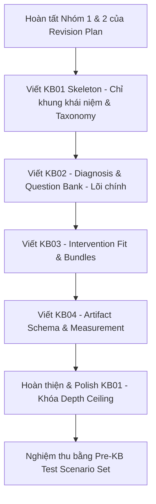

# Senior Review Report — Consolidated Review & Final Revision Plan
**Vai trò:** Senior Reviewer khó tính  
**Đối tượng:** Đối chiếu báo cáo review hiện tại với báo cáo của AI đối tác để lập **Final Revision Plan** hoàn chỉnh cho Research Expansion Pack (KB01–KB04).

---

## 1. Overall Verdict

> **Consolidated Verdict: Usable with Major Gaps (Cần hoàn thành Revision Plan trước khi viết KB)**

Cả hai báo cáo đều đồng thuận rằng Research Expansion Pack có nền tảng tốt, cấu trúc logic mạch lạc, nhưng **chưa sẵn sàng để viết KB hoàn chỉnh ngay**. 
* Báo cáo của AI đối tác nhận định mức độ "Usable with minor revision", nhưng thông qua đối chiếu chi tiết các gap (đặc biệt là thiếu Test Scenarios, thiếu Allocation Matrix và rủi ro Clinical/Legal), mức độ nghiêm trọng thực tế tương đương với **"Usable with Major Gaps"**.
* Cần triển khai một đợt sửa đổi ngắn tập trung để xử lý dứt điểm các gap cốt lõi trước khi viết KB.

---

## 2. Điểm tương đồng và Khác biệt giữa 2 Báo cáo

Sau khi đối chiếu báo cáo hiện tại (Báo cáo A) với báo cáo của AI đối tác (Báo cáo B), các điểm phát hiện bao gồm:

### 2.1. Các điểm tương đồng (Đã đồng thuận)
* **Xương sống logic tốt:** Cả hai cùng đánh giá cao luồng đi từ symptom → diagnosis → intervention → artifact → measurement.
* **Scope discipline chặt chẽ:** Việc phân tầng Core / Near / Extended / Out-of-scope trong Keyword Matrix hoạt động hiệu quả.
* **Needs verification bỏ lửng:** Cả hai đều phát hiện các thuật ngữ như Kirkpatrick, 70-20-10, RACI/RAPID, Mendelow Matrix, power-interest grid cần được kiểm chứng/generic hóa thay vì viết như một chuẩn học thuật chắc chắn.
* **Thiếu Measurement & Feedback Loop:** Thiếu logic xử lý khi mất baseline (Missing evidence fallback) và sự chồng chéo measurement giữa KB03 & KB04.

### 2.2. Điểm Báo cáo A đã phát hiện nhưng Báo cáo B bỏ sót
* **Lỗi logic trong Node Prioritization Table (prompt5):** Việc "ép" điểm số cao (27, 28 điểm) xuống P2 chỉ để thỏa mãn giới hạn 8 node P1 mà không có quy tắc tie-breaker là lỗi thiết kế hệ thống.
* **Rủi ro Clinical ngầm từ Psychological safety/burnout (prompt4):** Chatbot chưa có danh sách từ khóa nhạy cảm (stress nặng, kiệt sức, khóc) để kích hoạt dừng tư vấn tâm lý cá nhân.
* **Over-engineering trong Research Path (prompt6):** Việc yêu cầu viết 8 sheets phụ sẽ làm phình to dữ liệu đầu vào, gây nhiễu vector search (retrieval noise) cho Custom GPT.

### 2.3. Điểm Báo cáo B đã phát hiện nhưng Báo cáo A bỏ sót
* **P1 node bị "meta" (Thiếu Allocation Matrix):** Các node P1 như "OD Advisory Logic", "Boundary Pattern" chỉ là logic vận hành chứ không phải nội dung cụ thể, dễ dẫn đến viết trùng lặp giữa các KB.
* **Thiếu Pre-KB Test Scenario Set:** Cần có bộ test tối thiểu 12 case để nghiệm thu chatbot sau khi viết xong KB.
* **KB01 chưa có "Depth Ceiling" (Trần độ sâu):** Dễ khiến người viết sa đà vào viết lý thuyết giáo điều về OD.
* **Boundary note nằm rải rác:** Cần tập hợp lại thành một **Boundary Trigger Table** duy nhất để quản trị tập trung.
* **Nhầm lẫn nhãn hiệu:** Cần siết lại nhãn **"Change Enablement for OD"** thay vì "Change Management" để tránh trôi sang domain consulting doanh nghiệp.

---

## 3. Consolidated Critical Gaps & Scope Drift

Bảng dưới đây tổng hợp đầy đủ các gap từ cả 2 báo cáo, được sắp xếp theo mức độ nghiêm trọng và phân loại rõ ràng:

| # | Gap / Rủi ro | Phân loại | Tác động | Giải pháp tích hợp (Consolidated Fix) |
|---|--------------|-----------|----------|---------------------------------------|
| 1 | **Thiếu KB Allocation Matrix** | Gap | Gây trùng lặp nội dung nghiêm trọng giữa KB01, KB02, KB03 và KB04. | Tạo bảng: `P1 Node → Section cụ thể trong KB → Độ sâu → Vùng cấm viết (để tránh trùng)`. |
| 2 | **Boundary Pattern rải rác & Rủi ro Clinical/Legal** | Risk (Safety) | Bot dễ vi phạm "no individual judgment", tư vấn luật ngầm, hoặc tư vấn tâm lý khi gặp user kiệt sức. | Gom thành **Boundary Trigger Table** tập trung: `Trigger/Keyword → Must not do → Safe alternative → Refer to expert → Placement KB`. Bổ sung **Clinical Warning Keywords**. |
| 3 | **Cần Verification Register cho thuật ngữ** | Assumption | Đưa các framework chưa kiểm chứng nguồn như Kirkpatrick, 70-20-10, Mendelow vào KB như chuẩn chắc chắn. | Tạo **Verification Register**: `Thuật ngữ → Nguồn & Tình trạng → Quyết định dùng (Generic hóa hay Giữ nguyên hay Loại bỏ)`. |
| 4 | **Thiếu Pre-KB Test Scenario Set** | Gap (Validation) | Không có bộ test chuẩn để nghiệm thu chất lượng câu trả lời và độ an toàn của bot sau khi viết KB. | Thiết lập **Test Scenario Set gồm 12 case**: 7 problem types, 2 high-risk (clinical/legal), 1 measurement, 1 manager guide, 1 employee FAQ. |
| 5 | **Lỗi logic chấm điểm ưu tiên (P1 vs P2)** | Contradiction | Mất tính nhất quán trong quy chuẩn thiết kế thông tin. | Điều chỉnh thang điểm P1 lên `29–30`. Thêm cột `Tie-breaker Rationale` cho các node 27, 28 điểm bị hạ xuống P2. |
| 6 | **Thiếu "Depth Ceiling" cho KB01** | Risk (Over-engineering) | KB01 bị viết quá dài, gây nặng Custom GPT và loãng retrieval. | Áp dụng **KB01 Depth Rule**: mỗi core concept chỉ viết dưới 150 từ gồm: Definition, Why it matters, Bot use case, Boundary. Không viết lịch sử/học thuyết. |
| 7 | **Thiếu "Audience Adaptation Rules"** | Gap | Artifact tạo ra đúng tên nhưng sai đối tượng (ví dụ: Memo cho sếp quá dài, FAQ cho nhân viên quá học thuật). | Thêm rule: `Audience (Executive/Manager/Employee) → Purpose → Depth → Tone → Wording constraint`. |
| 8 | **Trôi nhãn Change Management** | Scope Drift | Nhầm lẫn giữa change enablement của dự án OD với change consulting tổng quát của doanh nghiệp. | Đổi toàn bộ nhãn trong KB thành **Change Enablement for OD**. |

---

## 4. Final Revision Plan

Để chuẩn bị tốt nhất cho giai đoạn viết KB, chúng ta sẽ thực hiện đợt sửa đổi này theo các nhóm ưu tiên:

### Nhóm 1 — Ưu tiên cao (High Priority — Phải làm trước khi viết KB)
1. **Tạo Boundary Trigger Table tập trung** (Adjacent Domain Boundary Map + Measurement/Artifact Library + Clinical Warning Keywords).
2. **Tạo KB Allocation Matrix** (Phân bổ P1 nodes vào các section cụ thể trong KB01–KB04, chặn trùng lặp).
3. **Tạo Verification Register** (Rà soát và generic hóa các thuật ngữ như Kirkpatrick, 70-20-10, Mendelow, RACI/RAPID).
4. **Sửa logic chấm điểm trong Node Prioritization Table** (Sửa thang điểm P1 thành 29-30, thêm giải thích tie-breaker).

### Nhóm 2 — Ưu tiên trung bình (Medium Priority — Hoàn thiện song song khi viết KB)
5. **Thiết lập Audience Adaptation Rules** (Quy tắc viết tone/depth theo audience cho KB04).
6. **Bổ sung Missing Evidence Protocol & Metric Thresholds** (Cung cấp hướng xử lý khi mất baseline và interpretation rules cho measurement).
7. **Đổi tên toàn bộ nhãn Change Management** thành **Change Enablement for OD**.
8. **Thiết lập KB01 Depth Ceiling** để khống chế độ dài KB01.

### Nhóm 3 — Ưu tiên thấp (Low Priority — Hoàn thiện trước khi chạy Test)
9. **Tạo Pre-KB Test Scenario Set** (12 case thử nghiệm để nghiệm thu chatbot).
10. **Gắn External Validation Flag** vào các section nhạy cảm trong KB (Legal review, Analytics validation).

---

## 5. Sequence Viết KB Đề Xuất (Sau khi hoàn tất Revision Plan)

*Trật tự này đảm bảo logic chẩn đoán (KB02) luôn đi trước để định hình giải pháp can thiệp (KB03) và biểu mẫu đầu ra (KB04). KB01 đóng vai trò bao bọc khái niệm và từ điển thuật ngữ.*

---
*Báo cáo đối chiếu được thực hiện nghiêm túc, loại bỏ mọi sự trùng lặp và giữ vững tinh thần bảo vệ tính an toàn, thực dụng cho chatbot HR/OD Advisor.*
